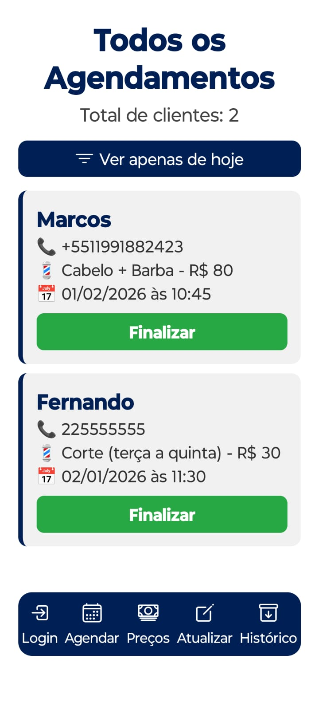

# Aplicativo LucasF
## 📸 Screenshots

### Login

### Bem-vindo / Cadastro

### Todos os agendamentos

### Agendamentos de hoje

### Atualizar preços

Aplicativo de barbearia desenvolvido em **React Native** com **Expo** e **Firebase**.

## 🚀 Funcionalidades

- Cadastro e login de clientes
- Agendamento de serviços (barba, cabelo, etc.)
- **Alteração de preço em tempo real**
- Histórico de agendamentos com opção de exclusão
- Visualização de preços atualizados no app do cliente
- Conexão com Firebase para dados em tempo real

## 🛠️ Tecnologias

- React Native
- Expo
- Firebase (Auth, Firestore, Realtime Database)

## Portfólio

Este projeto serve como demonstração prática de um app completo de agendamento de barbearia, integrando backend em tempo real e funcionalidades de usuário.
